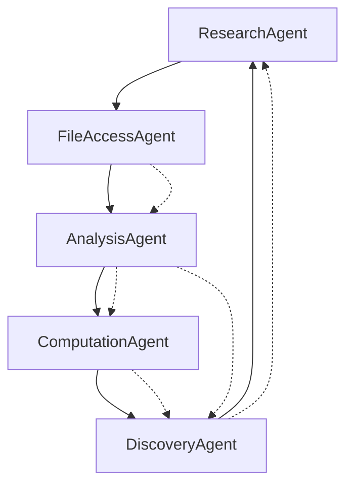

# 🚀 Enhanced AI Agent Capabilities Summary

## 📊 **Complete File Access Matrix**

### ✅ **JSON Files** (Full Read Access)
```python
# Tools: read_json_file(file_type)
await read_json_file("divisor_formulas")     # 31 mathematical formulas with LaTeX
await read_json_file("function_registry")   # 38 enhanced functions with metadata  
await read_json_file("custom_functions")    # User-generated AI functions
```

### ✅ **LaTeX Research Paper** (Full Read Access)
```python  
# Tools: read_latex_paper(section)
await read_latex_paper("abstract")          # Leo J. Borcherding's abstract
await read_latex_paper("introduction")      # Research introduction
await read_latex_paper("all")              # Complete paper (3000+ chars)
```

### ✅ **Python Modules** (Source Code Access)
```python
# Tools: read_python_module(module_type)
await read_python_module("special_functions")  # 38 functions + GPU/JIT code
await read_python_module("function_registry")  # Unified registry system
await read_python_module("latex_builder")      # LaTeX generation code
await read_python_module("plotting_methods")   # Advanced plotting code
```

### ✅ **Mathematical Computation**
```python
# Tools: execute_function(), analyze_function_properties()
await execute_function("product_of_sin", "x=2.5, n=100")
await analyze_function_properties("Riesz_Product_for_Cos")
```

## 🤖 **Agent Handoff Workflow**



### 🎯 **Specialized Agent Roles**

1. **ResearchAgent** (Coordinator)
   - Orchestrates research sessions
   - Records notes with `record_research_notes()`
   - Manages session state
   - Can hand off to ANY agent

2. **FileAccessAgent** (Data Retrieval)  
   - Reads all JSON files: formulas, registry, custom functions
   - Accesses LaTeX paper sections
   - Reads Python module source code
   - Hands off to: AnalysisAgent, ComputationAgent

3. **AnalysisAgent** (Pattern Recognition)
   - Analyzes function properties
   - Generates hypotheses with `generate_hypothesis()`
   - Identifies mathematical relationships
   - Hands off to: ComputationAgent, DiscoveryAgent, ResearchAgent

4. **ComputationAgent** (Numerical Analysis)
   - Executes mathematical functions
   - Performs numerical verification  
   - Tests hypotheses computationally
   - Hands off to: DiscoveryAgent, AnalysisAgent

5. **DiscoveryAgent** (Function Generation)
   - Discovers patterns with `discover_function_patterns()`
   - Generates new function variants
   - Creates hybrid mathematical structures
   - Hands off to: ComputationAgent, ResearchAgent

## 🛠️ **Comprehensive Tool Arsenal**

### File Access Tools (3)
- `read_json_file(file_type)` - Access JSON databases
- `read_latex_paper(section)` - Read research paper 
- `read_python_module(module_type)` - Access source code

### Mathematical Tools (2)  
- `execute_function(name, params)` - Run computations
- `analyze_function_properties(name)` - Deep analysis

### Research Tools (3)
- `record_research_notes(notes, category)` - Session management
- `generate_hypothesis(topic, evidence)` - AI hypothesis generation
- `discover_function_patterns(family)` - Pattern recognition

## 💡 **Usage Examples**

### Simple Query
```python
agents = EnhancedMathematicalAgents(llm)
result = await agents.start_research_session(
    "What are the properties of Riesz products?"
)
```

### Complex Research Workflow
```python
# 1. ResearchAgent coordinates
# 2. FileAccessAgent reads divisor_wave_formulas.json
# 3. AnalysisAgent analyzes Riesz function patterns  
# 4. ComputationAgent tests numerical properties
# 5. DiscoveryAgent generates new Riesz variants
# 6. ResearchAgent documents findings
```

## 🎯 **Key Advantages**

✅ **Complete Project Access**: Every file, every function, every formula
✅ **Intelligent Handoffs**: Agents collaborate based on expertise  
✅ **State Management**: Research sessions preserve context
✅ **Modular Design**: Add new agents without breaking existing ones
✅ **Tool Specialization**: Each agent has relevant tools only

## 🚀 **Activation**

```bash
cd divisor-wave-agent
pip install llama-index llama-index-llms-openai

python -c "
from src.agents.enhanced_mathematical_agents import EnhancedMathematicalAgents
from llama_index.llms.openai import OpenAI

llm = OpenAI(model='gpt-4')
agents = EnhancedMathematicalAgents(llm)
result = await agents.start_research_session('Generate new divisor wave functions')
"
```

The enhanced AI agents now have **COMPLETE ACCESS** to your entire mathematical research ecosystem! 🌊🤖